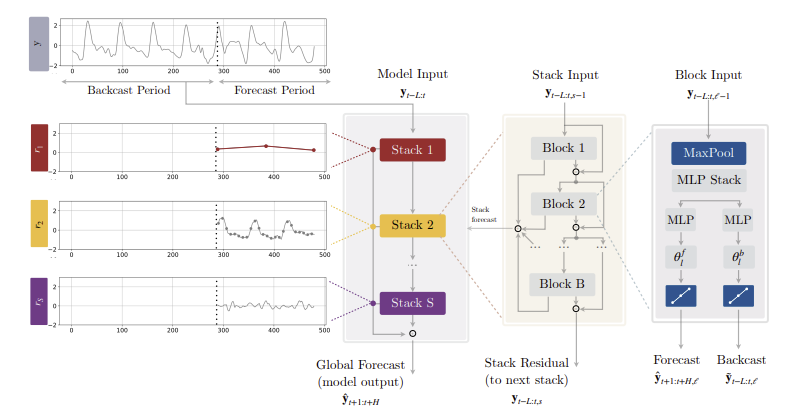
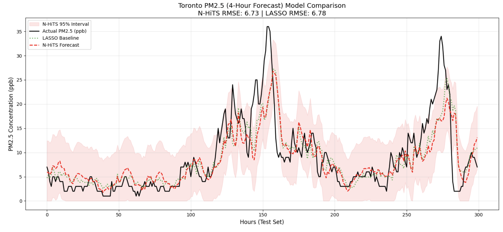

# Intro

## Background, stakeholders, operational value

Organization: Toronto Transit Commission (TTC)\
Primary stakeholder: Director of Station Operations and Maintenance

Operational context:

-   Subway stations rely on HVAC systems that draw outside air
-   During outdoor $PM_{2.5}$ spikes, filters degrade faster and indoor air quality risk increases
-   Forecasts enable proactive station ventilation actions (pre-ventilate, reduce intake during spikes, recirculation)

---

## Research questions

Primary:

How accurately can hourly $PM_{2.5}$ in Ontario be forecasted at a short horizon ($h = 4$ hours) using meteorological data?

## Case Study 1 vs Case Study 2

Limitations identified in case study 1:

-   Traffic data only available daily, forcing hourly $PM_{2.5}$ to be averaged into daily values, losing spike timing
-   Traffic impact was weak. Weather and seasonality were the true drivers

Key changes in case study 2:

-   Remove unhelpful traffic signal, focus entirely on weather drivers
-   Improve data resolution by using hourly weather and historical $PM_{2.5}$ to predict future hourly $PM_{2.5}$ 
-   Focus on prediction rather than interpretability 
-   Focus on the closest air quality and meteorological station

# Data and preprocessing

## Data Sources and Cleaning

Air quality: hourly pollutant $PM_{2.5}$ concentrations in downtown Toronto

Weather: hourly meteorology (temperature, humidity, wind speed, precipitation, air pressure, dew point temperature) in downtown Toronto

Alignment:

-   Join by timestamp (date-hour) at a Toronto monitoring station
-   Hourly data from 2019/06/22 to 2025/12/31 **(total 56,362 rows)**

Core steps:

-   Merge: hourly weather with hourly $PM_{2.5}$ by timestamp
-   Missingness handling:
    -  ~ 1% of $PM_{2.5}$ data was missing 
    -  $PM_{2.5}$ missingness was forward filled up to 4 hours, else the remaining rows were dropped
    - Weather variables all had < 1% missingness -- missing variables were forward filled
-   Feature construction:
    -   Cyclical time features for hour and month 

# Baseline models

## 1. Establishing the Baseline

**The Forecasting Objective:** Predict the **+4h future PM2.5 concentration** utilizing a rolling **24-hour historical lookback window**.

**The Challenge:** Feeding 24 hours of multiple weather variables (temp, wind, humidity, etc.) into a linear model creates a highly dimensional, collinear feature space.

**The Solution: Lasso ($L_1$ Regularization)**

$$
\hat{\beta} = \arg\min_{\beta} \underbrace{\sum_t (\text{PM2.5}_{t+4} - \beta_0 - \beta^\top X_{t-23:t})^2}_{\text{1. Minimize Error}} + \underbrace{\lambda \lVert \beta \rVert_1}_{\text{2. Penalty Term}}
$$

**Why it fits our data:**

- **Feature Selection:** The penalty shrinks the weights of irrelevant lags and weather noise to *exactly zero*.

---

## 2. Implementation Workflow

**1. Data Transformation**

- **Flattening:** Reshaped the 24h 2D historical weather windows into 1D vectors.

- **Scaling:** Standardized ($Z$-scores) to ensure unbiased penalty application across varying physical units.

**2. Strict Chronological Split & Time-Series CV**

- **The Split:** Time-series data is never randomly shuffled. We allocated the **first 85% of data for Training & CV**, keeping the **final 15% completely isolated for Testing**.

- **Expanding Window (5 Folds):** Standard cross-validation leaks future data into the past. We used `TimeSeriesSplit` on the 85% block to both train on a growing history and validate on the immediate rolling future.

**3. Hyperparameter Fine-Tuning**

- **Alpha Tuning:** Utilized `LassoCV` (`max_iter=10000`) to dynamically sweep for the optimal penalty strength ($\alpha \equiv \lambda$) across our 5 chronological folds.

---

## 3. Limitations & The Path Forward

**What Lasso Did Well:**

- Filtered out noise and provided a solid RMSE benchmark.

**The Limitation:**

- Lasso is fundamentally a **linear** model constrained by the 24h window's dilution effect.

- It struggles to capture **non-linear, dynamic shocks**.

**The Solution: N-HiTS**

- We need a complex architecture capable of separating slow atmospheric trends from sudden weather shocks.

# Complex model: N-HiTS

## Why N-HiTS

\begin{alertblock}{Definition}
N-HiTS: Neural Hierarchical Interpolation for Time Series
\end{alertblock}

::: columns

::: column

Goal: capture nonlinearities and multi-scale temporal structure with a deep, compute-heavy model.

Why it fits air-quality data:

- multi-resolution learning (slow trends + fast spikes)
- non-linear mapping from weather and seasonality to PM$_{2.5}$
- residual learning to decompose signal into components

:::

::: column
Input and output shapes:

$$
x_t \in \mathbb{R}^{L \times d},\quad d=11
$$

$$
\hat{y}_{t+1:t+24} = f_\theta(x_t),\qquad
\hat{y}_{t+4} = \left[\hat{y}_{t+1:t+24}\right]_4
$$

- lookback: $L = \{24\}$
- horizon head: 24-step output, but we report the 4-hour-ahead value
:::

:::

---

## N-HiTS Architecture: Hierarchical multi-resolution

::: columns

::: column
The N-HITS model as “3 frequency stacks":

- Stack 1 (macro) $\rightarrow$ Block 1: max-pool $\times 4$, $n_\theta=6$
- Stack 2 (mid) $\rightarrow$ Block 2: max-pool $\times 2$, $n_\theta=12$
- Stack 3 (fine) $\rightarrow$ Block 3: no pooling, $n_\theta=24$

:::

::: column
{width=100%}
:::

:::

---

## Our N-HiTS structure

Three frequency blocks:

| Block | Pool size | Resolution captured | Forecast knots |
|------|------|------|------|
| Block 1 | 4 | long-term trends | 6 |
| Block 2 | 2 | medium variation | 12 |
| Block 3 | 1 | short-term spikes | 24 |

Forecast combination:

- each block produces a forecast
- forecasts are summed
- we evaluate the **4-hour-ahead prediction**

---

## How one N-HiTS block works

Pipeline inside each block:

::: columns

::: column

1. **Pooling (multi-scale view)**  
   Compress the input window to capture patterns at a specific time scale.

   - Block 1: coarse trends (pool ×4)  
   - Block 2: medium variation (pool ×2)  
   - Block 3: fine detail (pool ×1)

2. **MLP encoder**  
   A small neural network learns a hidden representation of the time window.

3. **Backcast**  
   The block reconstructs the part of the input signal it can explain.

:::

::: column
{width=100%}
:::

:::

---

## How one N-HiTS block works

Pipeline inside each block:

::: columns

::: column

4. **Residual update**  
   The explained signal is removed so the next block focuses on what remains.

5. **Forecast generation**  
   The block predicts a small set of forecast knots.

6. **Interpolation to horizon**  
   These knots are linearly interpolated to produce a 24-step forecast.

:::

::: column
{width=100%}
:::

:::

Final prediction:
$$
\hat{y} = \hat{y}^{(1)} + \hat{y}^{(2)} + \hat{y}^{(3)}
$$

\begin{alertblock}{}
Each block contributes a forecast at a different temporal resolution.
\end{alertblock}

---

## Target-specific residual learning

Split features:

- target: PM$_{2.5}$
- exogenous: weather + time features

Residuals are applied only to the target channel:

$$
r^{(1)} = y_{\text{target}} - \widehat{x}^{(1)}_{\text{target}}
$$

For block 2 and 3, the input is:

$$
x^{(k)} = \big[r^{(k-1)},\ \text{exog}\big]
$$

Final forecast is the sum of all block forecasts:

$$
\hat{y}_{t+1:t+24} = \widehat{y}^{(1)} + \widehat{y}^{(2)} + \widehat{y}^{(3)},
\qquad
\hat{y}_{t+4} = \left[\hat{y}_{t+1:t+24}\right]_4
$$

---

## Training and evaluation

Data:

- standardized 11 features (PM$_{2.5}$ + weather + seasonal sin/cos)
- split: 70% train, 15% validation, 15% test (time-ordered)

Optimization:

- loss: MSE
- optimizer: Adam
- epochs: up to 50
- early stopping: patience = 8 (best val RMSE checkpoint)

Metrics:

- RMSE on test set for 4-hour-ahead prediction

Compute:

- GPU (Waterloo Remote Server), batch size 128

---

## Hyperparameter tuning

We run a small hyperparameter sweep centered on best-performing configs:

- lookback $L \in \{24, 48\}$
- hidden width $\in \{128, 256, 512\}$
- learning rate $\in \{0.001, 0.0005, 0.0001, 0.00005\}$

Selection rule:

- choose lowest validation RMSE
- trainable parameters: 1,453,890 parameters

\begin{alertblock}{Chosen config}
$L=24$, hidden width $=512$, learning rate $=0.00005$
\end{alertblock}

# Comparison and evaluation

## Model Performance - Forecast

{width="80%"}

---

## Model Performance - RMSE Comparison

| Model  | RMSE   | MAE    |
|--------|--------|--------|
| LASSO  | 6.7789 | 4.1672 |
| N-HiTS | 6.8246 | 4.1761 |

: Model RMSE Comparison {#tbl-model-rmse}

- The LASSO and N-HiTS models produce very similar RMSE and MAE values.
- The N-HiTS model's ability to capture non-linearities and multi-scale patterns does not translate into a significant improvement in forecasting accuracy for this dataset, suggesting that the underlying dynamics may be relatively simple.

## Overall Forecasting Accuracy and Effectiveness 

- The RMSE and MAE of the N-hits model indicates moderate predictive accuracy, meaning that although the model cannot reliably predict the exact concentration it can still capture overall trends and rising pollution events.

- The model’s 95% confidence interval provides a useful upper bound for predicted $PM_{2.5}$ , allowing TTC operators to anticipate when pollution may reach harmful levels (e.g., >50 $\mu \text{g/m}^3$) and adjust HVAC systems proactively before spikes occur.

- This forecasting system should be treated as an early-warning decision support tool, not a precise measurement system.

## 

\vspace{1.5cm}

\begin{center}
\Huge \textbf{Thank You!}
\end{center}